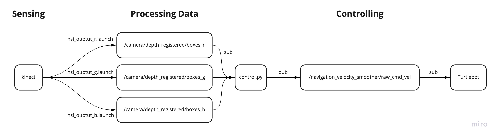

# Robot System Programming
Junior year in Mechano-Informatics, University of Tokyo, Fall 2021

## Final Project - Robot Slalom


### Concept

First, we use kinect to gather information on the color space and the position of deteced obstacles. Next, we apply three filters that are previously designed to extract each channel of the rgb input image to determine the color of the detected obstacles. Using the above information, we can plan the motion of the turtlebot for it to successfully perform slaloming.

### Prerequisites
First, you wiil need to create a workspace following the instructions in the [jsk-enshu/robot-programming](https://github.com/jsk-enshu/robot-programming) repository. Next, setup the connection between your computer and the turtlebot.

### Usage
Run the following commands from the terminal to setup the environment
```
$roslaunch turtlebot_bringup minimal.launch
$roslaunch turtlebot_bringup 3dsensor.launch
$roslaunch dxl_armed_turtlebot dxl_armed_turtlebot_navigation.launch
$roslaunch turtlebot_rviz_launchers view_navigation.launch
```
Run the three launch files below as well to initiate the following topics: 

- /camera/depth_registered/boxes_r
- /camera/depth_registered/boxes_g
- /camera/depth_registered/boxes_b

```
$roslaunch final/hsi_output_r.launch
$roslaunch final/hsi_output_g.launch
$roslaunch final/hsi_output_b.launch
```

Finally, run `final/control.py` from the terminal and voila! The turtlebot will start moving! The output describing the slaloming movement should look like this:

```
$[INFO] Turning right ... 
$[INFO] Moving 0.55m forawrd ... 
$[INFO] Turning left ...
$[INFO] Moving 1.33m forawrd ... 
$[INFO] Turning left ...
$[INFO] Moving 0.54m forawrd ... 
$[INFO] Turning right ... 
$[INFO] Moving 1.10m forawrd ... 
$[INFO] Turning right ... 
$[INFO] Moving 0.55m forawrd ... 
$[INFO] Turning left ...
$[INFO] Moving 1.22m forawrd ...
```

### Further Improvement

- [ ] Improve the success rate
- [ ] Make the outcome of slaloming independent of the initial position/orientation of the turtlebot
- [ ] Use classes to simplify the code